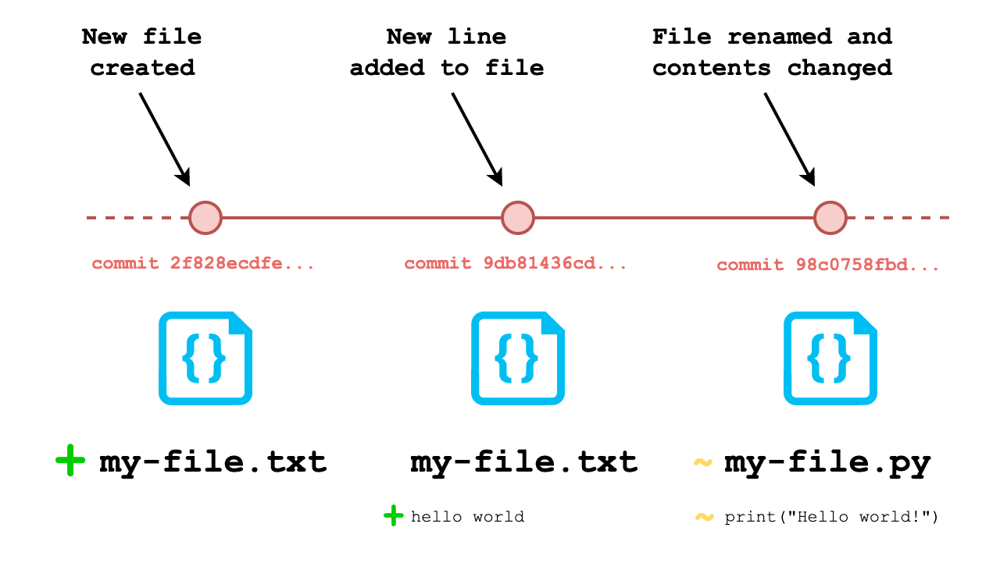
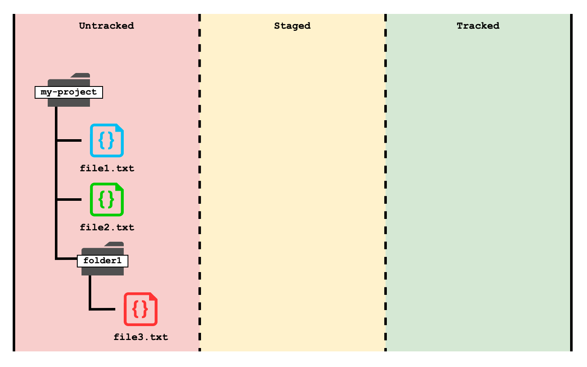
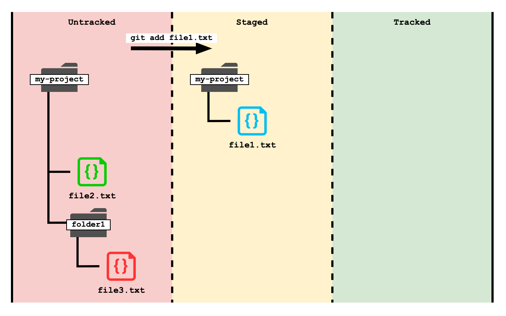
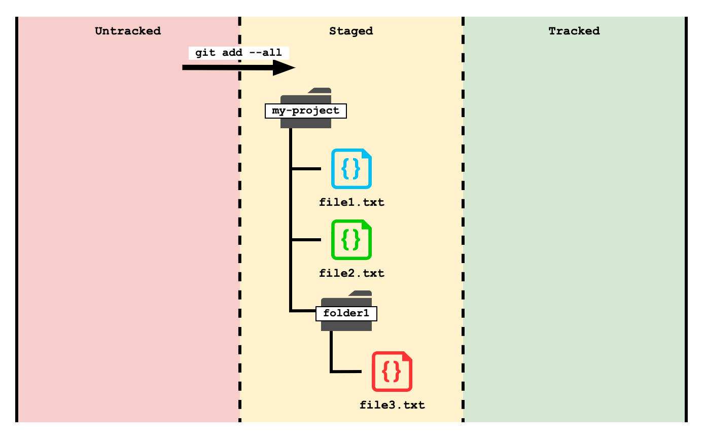
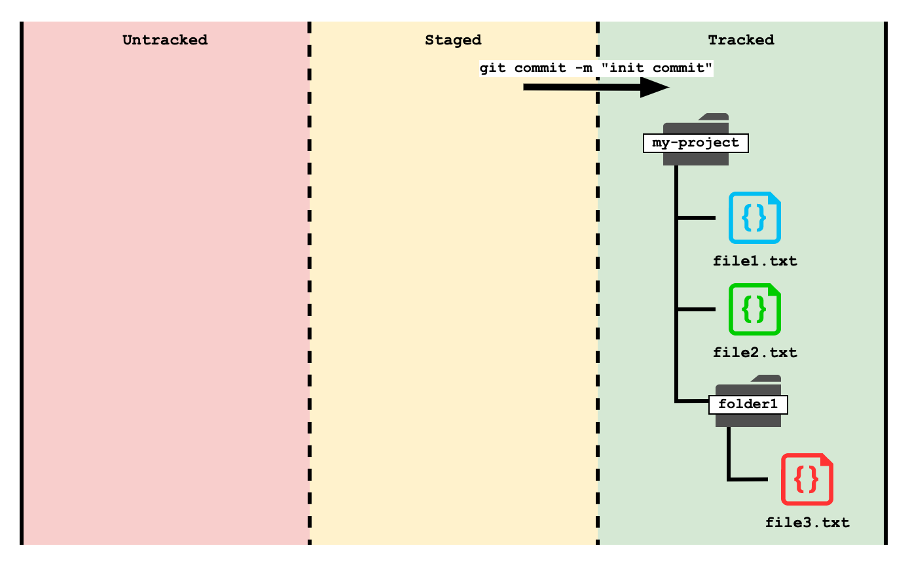

# Basics

- [Basics](#basics)
  - [Overview](#overview)
  - [Git](#git)
    - [Installation](#installation)
    - [Using Git](#using-git)
    - [Setup](#setup)
    - [Creating a Repository](#creating-a-repository)
    - [Commits](#commits)
      - [Staging (`git add`)](#staging-git-add)
      - [Committing (`git commit`)](#committing-git-commit)
      - [History (`git log`)](#history-git-log)
    - [Ignoring Files](#ignoring-files)
      - [The `.gitignore` file](#the-gitignore-file)
  - [Tutorial](#tutorial)
    - [Create a New Repository](#create-a-new-repository)
    - [Create Some Files](#create-some-files)
    - [Stage a Commit](#stage-a-commit)
    - [Make a Commit](#make-a-commit)
    - [Edit a File and Commit the Change](#edit-a-file-and-commit-the-change)
  - [Exercises](#exercises)

## Overview

**Git** is a *version control system (VCS)* or *source code management (SCM)* tool. It is used to track every change made to software source code over the entire lifetime of a project.

By keeping track of every change made to a software project, software development teams can:

- Keep track of who made what changes to the code.
- Keep track of when changes were made.
- Revert software back to any point in the history of the project.

Git is also invaluable to software development teams as a **collaboration tool**. Because every change is tracked and timestamped, teams of developers are able to make changes to the source code in parallel and merge those changes together without accidentally overwriting other members' work.

## Git

**Git** was created by Linus Torvalds for use in developing the Linux kernel – a massive open-source project with contributors across the world.

It is **free** and **open-source**, and has become the most popular version control system in the world, used by industry professionals and coding hobbyists alike.

It is a **distributed version control system**, meaning that every Git directory (another term for folder) for a project, regardless of where it is hosted, contains the full history of changes made to the project.

In Git, there is no single central location that stores the 'master' copy of the project. Updates to the project can come from any other instance of the project.

<!-- Terminology:

| Term       | Description                                                                      |
| ---------- | -------------------------------------------------------------------------------- |
| Repository | A folder containing files that are being tracked by Git.                         |
| Commit     | A recorded point in the history of the repository where files have been changed. | -->


### Installation

Git is cross-platform and can be installed on Windows, macOS or Linux distributions.

It can be downloaded here: https://git-scm.com/downloads

If you are installing Git on Windows, make sure to install Git Bash when you are prompted to do so by the installation wizard.

### Using Git

Git is primarily a command-line tool desgined to run on `bash`-style command-line interfaces (CLIs). To run Git commands on Linux or macOS, simply open up your terminal of choice. You can run the following command to check if Git is installed correctly:

```bash
git --version
```

If you get a version number back, Git has been installed successfully.

Windows does not have a `bash`-style CLI installed by default, so the Windows installation wizard will install a `bash` emulation program called **Git Bash**. This is the recommended way to interact with Git and the modules will assume you are doing so.

### Setup

Git can be configured on the command line with `git config ...` commands.

You can view the current configuration with the command:

```bash
git config --list --show-origin
```

This will show a list of values that have been configured and where they have been set. Configurations can be set globally (i.e. for the entire system) or per project.

Git assigns a name and contact email to every change (or commit) to a project (or repository). This allows anyone working on the project to keep track of who made changes and how to get in contact with them.

You can set your name with:

```bash
git config --global user.name "<your_name>"
```

You can set your email with:

```bash
git config --global user.email "<your_email"
```

> **Note:** The name and email you provide **do not** need to be the same as your GitHub (or other repository-hosting service) credentials, though it is usually most useful to set them as such. 

Sometimes Git will prompt you to edit the contents of a file. You can set your default command-line text editor with the command: 

```bash
git config --global core.editor <text_editor>
```

For users new to working on the CLI, `nano` is probably the most user-friendly CLI text editor.

### Creating a Repository

A **repository** is simply a folder whose files are being tracked by Git.

To make a folder a Git repository, run:

```bash
git init
```

That's it! After running `git init`, list the contents of the folder with:

```bash
ls -a
```

> **Note:** The `-a` option is short for 'all' and is used to display files that start with a full stop `.` – these are known as 'hidden files'.

You should see the contents of the repository. Make note of a newly-created folder called `.git`. This folder contains all the tracking information that relates to the Git repository.

You don't need to know anything about the contents of this folder (it's quite complicated), but if you ever wanted to stop tracking a folder with Git you need only delete the `.git` folder with the following command:

```bash
rm -rf .git
```

### Commits



Git 'tracks' files by keeping a record of every change made to files and their contents. Each change is recorded as point in history for the project timeline.

These points in the history of the repository are known as **commits**. You can think of it like taking a snapshot of the filesystem at a point of time.



Once a file has been committed, it is being tracked by Git. Files that are not committed are effectively invisible to Git.

The repository can then be *reverted* to the state it was in when a commit was made, even after hundreds of changes have been made since. **Every change is tracked and revertable.**

#### Staging (`git add`)

Before files can be committed to the version history, they must first be *staged*.

This initial step allows the developer to check they are happy with the changes that are being tracked before committing it to the version history.



To stage a single file:

```bash
git add <file_name>
```

Where `<file_name>` is the name of the file you are looking to stage.



Multiple files can be staged for commit at once. To stage all files in the current folder, including all files in child folders:

```bash
git add .
```

> **Note:** The full stop `.` is a special character in Bash that represents the current working directory.

To stage all files in the repository *regardless* of what the current working directory is:

```bash
git add --all
```

To check which files are currently staged to be committed:

```bash
git status
```

Example output:

```text
On branch main
Your branch is up to date with 'origin/main'.

Changes to be committed:
  (use "git restore --staged <file>..." to unstage)
        new file:   file1
        new file:   file2
        new file:   file3
        new file:   file4
        new file:   folder1/file5
        new file:   folder1/file6
        new file:   folder2/file7
```

#### Committing (`git commit`)

Once your files are staged, they can be committed to the version history with the command:

```bash
git commit -m "a short description of the changes made in this commit"
```



The `-m` option is short for 'message'. Every commit requires an accompanying message. This is to make it clear to everyone working on the project what every commit represents.

Commit messages should be succinct but descriptive. This is to allow development teams to easily read through commits and know what changes were introduced with each change.

Many companies have their own internal standards for how a commit message should be phrased and what information should be contained in them.

#### History (`git log`)

You can view all commits made to the repository from last to first using the command:

```bash
git log
```

Example output:

```text
commit 2f828ecdfe59ee9b9ebe87a5a3ebb863e4fda74d (HEAD -> main, origin/main, origin/HEAD)
Author: Tiffany <havin-a-tiff@gmail.com>
Date:   Fri Mar 25 15:04:59 2022 +0000

    restructuring project

commit 9db81436cde1e9b566fcc43950f7ad57d63509ee
Author: Frankie <to-be-frankie@hotmail.co.uk>
Date:   Thu Mar 24 13:01:49 2022 +0000

    creating README

commit 98c0758fbde205624262f81950087bd1de69a22f
Author: Larry <bit-of-a-larry@yahoo.com>
Date:   Tue Mar 22 14:53:23 2022 +0100

    initial commit
```

Notice that every commit contains the following information:

- **A unique hash** (e.g. `9db81436cde1e9b566fcc43950f7ad57d63509ee`), a long string used to uniquely identify each commit.
- **An author**, including their name and email.
- **The date/time** when the commit took place.
- **The commit message** that was written by the committer.

### Ignoring Files

There are often files that are either written for or generated by the project that we *do not* want to track as part of the version history.

Common types of files we would want to ignore include:

- **Files containing secret information** (login credentials, database connection strings, secret keys, authorisation tokens, etc.).
  
  Pushing these to a remote repository (such as one hosted on GitHub) is a serious security risk as it allows attackers access to your private systems.

- **Software packages**, such as Python modules or Java plugins.
  
  Code packages are often referenced by source code to extend a program's functionality. For the project to use them, they are often installed in the project folder.
  
  However, including them in Git commits adds significant bloat to the version history, which impacting Git's performance and can prevent the project from being uploaded to another location (for example, GitHub has a maximum project size of 100MB).

  Instead, packages should be installed by any user when they first download the Git repository. Typically, source code will contain a file with a list of packages required for the project to run.

- **Cache files**.
  
  Certain codebases (such as Python) cache data in files to improve the program's performance. While these files are usually small, they are unnecessary and clutter the project filesystem and so should be ignored.

- **Configuration information** for a specific application of a project.
  
  If one is making a generalised application, they don't want their configuration to interfere with anyone else's.

There is no strict rule for whether a file should be ignored or not, but a general rule of thumb is to ask yourself whether the file is *necessary* for the project to run **or** does the file contain *sensitive data* that you wouldn't want everyone to have access to.

#### The `.gitignore` file

To ignore a file, we add its name to a file called `.gitignore`.

The `.gitignore` file is typically created at the root of the repository and contains a list of naming patterns. Any file that fits a naming pattern will not be included by any `git add ...` command.

For example, a `.gitignore` file with the following contents will ignore files named `hello_world.txt` and `super_secret_deathstar_plans.xml`:

```text
hello_world.txt
super_secret_deathstar_plans.xml
```

To ignore any file that contains the phrase `super_secret`, you could use an asterisk `*` as a wildcard character:

```text
hello_world.txt
super_secret*
```

To make an exception for a file name/pattern that would otherwise be ignored, you can use an exclamation mark `!` in front of a pattern. The following will ignore all files starting with `super_secret` except for `super_secret_deathstar_plans_TEMPLATE.xml`:

```text
hello_world.txt
super_secret*
!super_secret_deathstar_plans_TEMPLATE.xml
```

To ignore only folders but *not* files with a specific name, you can end the pattern with a forward-slash `/`. The following will ignore any folders named `config` but will not ignore any files with that name:

```text
config/
```

GitHub provides a list of `.gitignore` templates for different types of project (e.g. Java, Python, C#) that can be found [here](https://github.com/github/gitignore).

Adding a file to the `.gitignore` file will **not** retroactively remove files from the version history – files will only be ignored from the point at which they are added and committed to `gitignore`. For this reason, you should make sure that your `.gitignore` file is the first thing you commit to the repository.

You can have multiple `.gitignore` files in a repository at different levels of the filesystem, meaning you could ignore files with a certain name in one folder but track them in another.

## Tutorial

This tutorial is designed to walk you through the basic workflow when working in a Git project.

We are going to:

- Create a repository.
- Create some files.
- Stage a commit.
- Commit the files.
- Make a change to the contents of a file and commit the change.

### Create a New Repository

First, we need to create a Git repository. We will be doing this on the command line.


1. Open your terminal program – *Git Bash* on Windows, *Terminal* on macOS or Ubuntu. Enter the following command to make the Documents folder your current working directory:

    ```bash
    cd ~/Documents
    ```

2. Create a new empty folder called `git-basics-tutorial` with the command:

    ```bash
    mkdir git-basics-tutorial
    ```

3. Change the current working directory to this new folder:

    ```bash
    cd git-basics-tutorial
    ```

4. Initialise the folder as a Git repository with the command:

    ```bash
    git init
    ```

    Enter `ls -a` to list the contents of the folder. You should see a new folder called `.git`.

### Create Some Files

Next, let's generate some files that we can start tracking with Git.

1. Create some new files with the command:

    ```bash
    touch file1 file2 file3
    ```

2. Create a new folder with the command:

    ```bash
    mkdir dir1
    ```

3. Create a new file in that folder with the command:

    ```bash
    touch dir1/file4 dir1/file5
    ```

    The file structure of the repository will now look like the following:

    ```text
    git-basics-tutorial/
    ├── file1
    ├── file2
    ├── file3
    └── dir1/
        ├── file4
        └── file5
    ```

### Stage a Commit

1. Stage `file1` with the command:

    ```bash
    git add file1
    ```

    Run `git status` to check which files have been staged. You should see the following output:

    ```text
    On branch master

    No commits yet

    Changes to be committed:
    (use "git rm --cached <file>..." to unstage)
            new file:   file1

    Untracked files:
    (use "git add <file>..." to include in what will be committed)
            dir1/
            file2
            file3
    ```

2. Change the current working directory to `dir1`:
   
    ```bash
    cd dir1
    ```

    Stage the contents of the current folder with:

    ```bash 
    git add .
    ```

    Run `git status` to check which files have been staged. You should see the following output:

    ```
    On branch master

    No commits yet

    Changes to be committed:
    (use "git rm --cached <file>..." to unstage)
            new file:   file4
            new file:   file5
            new file:   ../file1

    Untracked files:
    (use "git add <file>..." to include in what will be committed)
            ../file2
            ../file3
    ```

    Note that `file2` and `file3` in the parent folder have still not been committed.

    > **Note:** Two full stops `..` in Bash represent the parent folder of the current working directory, so `../file2` refers to a file called `file2` that is in the previous folder.

3. While still in the `dir1`, stage the rest of the files in the repository with:

    ```bash
    git add --all
    ```

    Run `git status` to check which files have been staged. You should see the following output:

    ```
    On branch master

    No commits yet

    Changes to be committed:
    (use "git rm --cached <file>..." to unstage)
            new file:   file4
            new file:   file5
            new file:   ../file1
            new file:   ../file2
            new file:   ../file3
    ```

    Note that all files in the repository have been staged for the next commit.

4. Change the current working directory to the root of the repository with the command:

    ```bash
    cd ..
    ```

### Make a Commit

1. Commit the staged files to the version history with:

    ```bash
    git commit -m "init commit"
    ```

    You should see the following output:

    ```text
    [master (root-commit) 86c6845] init commit
    5 files changed, 0 insertions(+), 0 deletions(-)
    create mode 100644 dir1/file4
    create mode 100644 dir1/file5
    create mode 100644 file1
    create mode 100644 file2
    create mode 100644 file3
    ```

2. View the commit history with the command:

    ```bash
    git log
    ```

    You should see a similar output to the following:

    ```text
    commit 86c6845b8437723256d50e6a68ec10d5ed831e81 (HEAD -> master)
    Author: Tiffany <havin-a-tiff@gmail.com>
    Date:   Fri Mar 25 14:59:04 2022 +0000

        init commit
    ```

### Edit a File and Commit the Change

1. Open `file1` using Notepad or similar text editor of your choice (avoid using a word processor such as Microsoft Word or Pages).
    
    Alternatively, you can edit the file from the command line using a text editor program such as `nano`:

    ```bash
    nano file1
    ```

2. Enter some text, such as:

    ```text
    Hello, world!
    ```

3. Save and close the file.

4. On the command line, enter:

    ```bash
    git add --all
    ```

    Run `git status` to check the changes that have been staged. You should see the following output:

    ```text
    On branch master
    Changes to be committed:
    (use "git restore --staged <file>..." to unstage)
            modified:   file1
    ```

5. Commit the new change:

    ```bash
    git commit -m "adding text to file1"
    ```

    You should see the following output:

    ```text
    [master aca9e89] adding text to file1
    1 file changed, 1 insertion(+)
    ```

6. Show the version history:

    ```bash
    git log
    ```

    You should see a similar output to the following:

    ```
    commit aca9e89679b0eee8ed32609b5a51030888b1f32a (HEAD -> master)
    Author: Tiffany <havin-a-tiff@gmail.com>
    Date:   Fri Mar 25 15:12:19 2022 +0000

        adding text to file1

    commit 86c6845b8437723256d50e6a68ec10d5ed831e81
    Author: Tiffany <havin-a-tiff@gmail.com>
    Date:   Fri Mar 25 14:59:04 2022 +0000

        init commit
    ```

## Exercises

Copy and paste the following commands into your terminal to create some new files:

```bash
mkdir documents secrets
touch README.md my_notes.md
touch documents/embarrassing_game_of_thrones_fanfic.md
touch secrets/{secret_key,secret_key.pub,db_credentials}
```

<details>
<summary>Click here to see the new file structure</summary>

```text
    .
    ├── README.md
    ├── file1
    ├── file2
    ├── file3
    ├── my_notes.md
    ├── dir1
    │   ├── file4
    │   └── file5
    ├── documents
    │   └── embarrassing_game_of_thrones_fanfic.md
    └── secrets
        ├── db_credentials
        ├── secret_key
        └── secret_key.pub
```

</details>

Create a `.gitignore` file and add entries to ignore:

- The `my_notes.md` file.
- The contents of the `documents` folder but *not* the folder itself.
- The `secrets` folder.

What's the fewest number of entries in the `.gitignore` that you need to achieve this?
