# Cloning

- [Cloning](#cloning)
  - [Overview](#overview)
  - [Cloning](#cloning-1)
    - [Remotes and the Origin](#remotes-and-the-origin)
    - [Pushing Changes](#pushing-changes)
    - [Pulling Changes](#pulling-changes)
  - [Tutorial](#tutorial)
    - [Creating a Git Repository on GitHub](#creating-a-git-repository-on-github)
    - [Clone the Repository](#clone-the-repository)
    - [Creating a File](#creating-a-file)
    - [Creating a Personal Access Token (PAT)](#creating-a-personal-access-token-pat)
    - [Pushing to GitHub](#pushing-to-github)
    - [Pulling New Changes from GitHub](#pulling-new-changes-from-github)
  - [Exercises](#exercises)

## Overview

***Cloning*** is the process of copying the contents of a Git repository from one location to another.

When a repository is cloned from the original repository (the *origin*) to a local machine, the two repositories are symbolically linked, meaning that any new changes made on the local machine can be easily *pushed* to the original repository and vice versa. This allows all clones of the repository to stay in sync with one another.

This module takes you through:

- How to clone a Git repository.
- The concept of remote repositories, in particular the *origin*.
- How to push new changes to the *origin*.
- How to pull new changes from the *origin*.

## Cloning

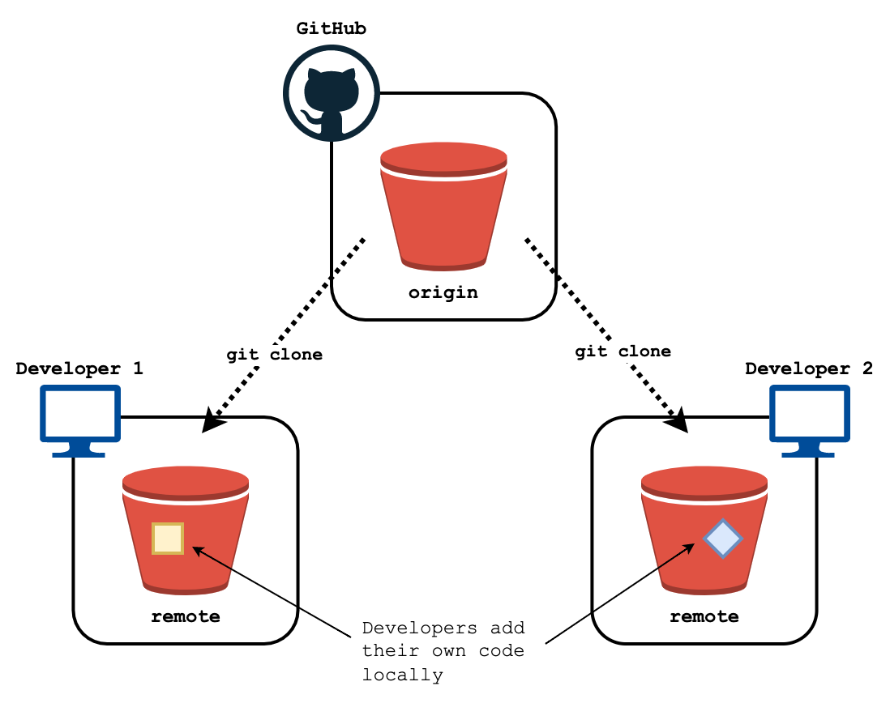

Cloning a repository allows members of a development team to work on a copy of the same codebase on their local machines.

You can clone a repository with the command:

```bash
git clone <repository_url>
```

Where `<repository_url>` is the location of the Git repo you are looking to copy, which is typically hosted on a repository-hosting website such as GitHub.

Starting a repository on GitHub (or other repository-hosting service) and cloning it down is typically the simplest and most straightforward way to start a new Git project.

This will create a copy of the cloned repository on your local machine, including the full commit history up to the point it had been cloned.

### Remotes and the Origin

We refer any copy of a Git repository as a *remote*. When a repo has been cloned, the location of the original repository (its URL) is stored as a variable called `origin`.

You can view the *origin* of a repository with the command:

```bash
git remote -v
```

Example output:

```bash
origin  https://github.com/htr-volker/using-git.git (fetch)
origin  https://github.com/htr-volker/using-git.git (push)
```

If the repository was created locally but you want to host it elsewhere (such as on GitHub) and treat that location as the *origin*, you can add the *origin* with:

```bash
git remote add origin <repository_url>
```

You can also overwrite the *origin* URL with the command:

```bash
git remote set-url origin <repository_url>
```

Keeping track of the repository's origin allows developers to push and pull new code to and from a central location.

This allows development teams to all work from the same codebase despite the project being hosted over multiple machines.

### Pushing Changes

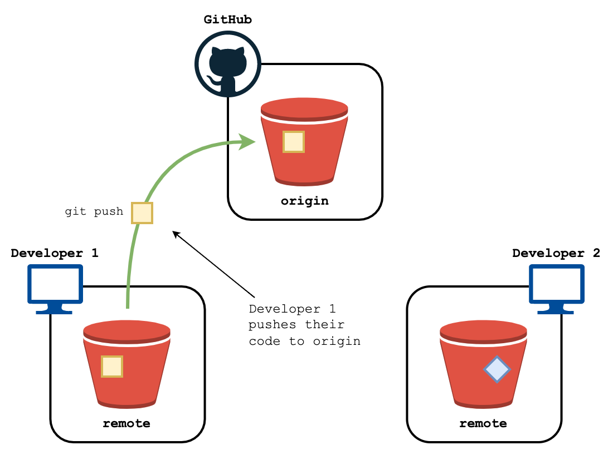

When a developer has committed their changes to their local version of the repository, they can then *push* those changes back to the *origin*.

This can be done with:

```bash
git push origin <branch_name>
```

Where `<branch_name>` is the name of the branch to be pushed to the origin. 

For example, if you wanted to push new changes committed to the `main` branch, you would enter `git push origin main`.

If you just want to push the changes you have made to your current branch to the *origin*, as a shorthand you can just enter:

```bash
git push
```

### Pulling Changes

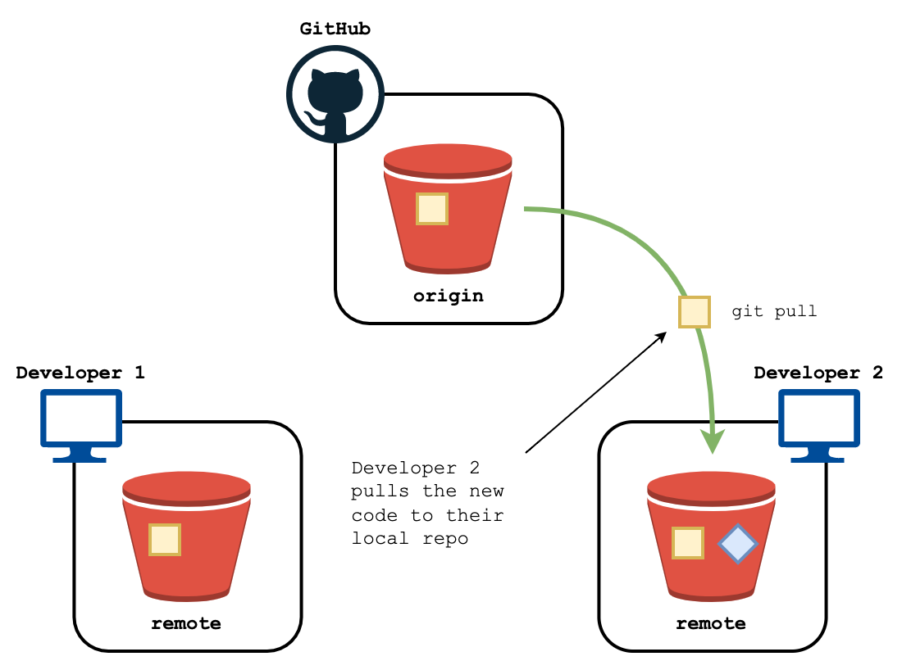

When a developer wants to retrieve the most up to date version of the current code from the *origin*, they can pull the new changes with the command:

```bash
git pull origin <branch_name>
```

Where `<branch_name>` is the name of the branch on the *origin* whose changes you want to reflect on the local version of the repository.

For example, if you wanted to pull down new changes committed to the *origin*'s `main` branch, you would enter `git pull origin main`.

If you just want to pull the changes from the *origin* to the current branch, as a shorthand you can just enter:

```bash
git pull
```

## Tutorial

This tutorial is designed to show you how to:

- Setting up a Personal Access Token for GitHub
- Create a new Git repository on GitHub.
- Clone the repository from GitHub.
- Commit new changes to the `main` branch.
- Push new changes back to GitHub.
- Create a new change on GitHub and pull it down to the local repo.

This tutorial assumes you have a GitHub account and have Git installed on your machine.

### Creating a Git Repository on GitHub

We're going to start our Git repository on GitHub and clone it to our local machine. This will make the GitHub repository the *origin*.

To create the repository on GitHub:

1. Log into GitHub and click on your user icon in the top right-hand corner of the page. Select 'Your repositories' from the dropdown menu.

    

2. In the top right-hand corner, select 'New'.

    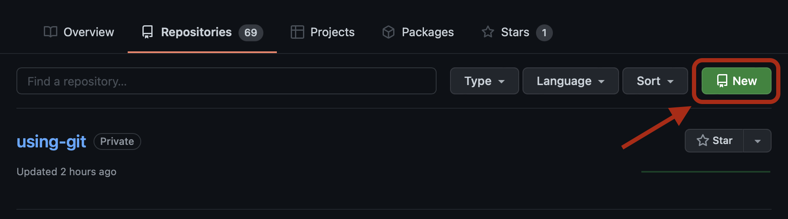

3. You will see a form for creating a new repository. Enter the following information:
   
   - **Repository name:** `git-cloning-tutorial`.
   - Set the repository to **Public**.
   - Under **Initialise this repository with:**, tick **Add a README file**.

    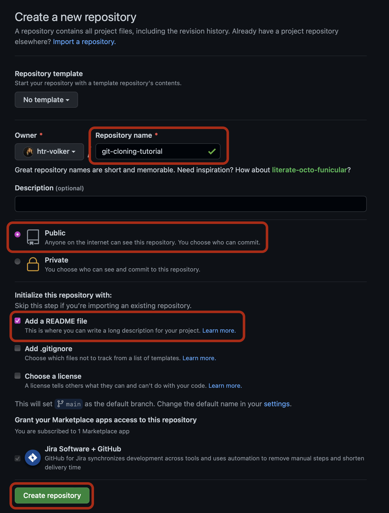

    Leave everything else set to its default. Then, select 'Create repository' at the bottom of the page.

You will be redirected to your new repository containing a single `README.md` file.

### Clone the Repository

Next, we will clone the repository from GitHub to our local machine.

To clone the repository:

1. Navigate to your newly-create repo on GitHub. Select the 'Code' button. Under the drop down that appears, make sure 'HTTPS' is selected and then copy the URL.

    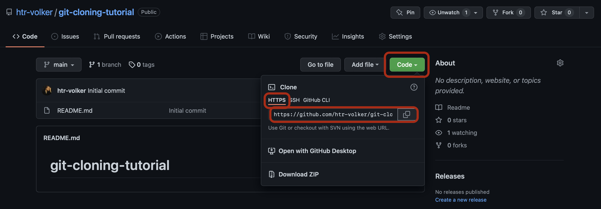

2. Open up your `bash` (or `zsh` if you're on a Mac) terminal program. On Windows, this will be 'Git Bash'; on macOS, this will be 'Terminal'.

3. Change the current working directory to your Documents folder. To do this, enter:

    ```bash
    cd ~/Documents
    ```

    > If you do not have a Documents folder on your machine, feel free to use any folder you wish.

4. Clone the GitHub repository into your Documents folder, replacing `<github_repo_url>` with the URL you copied in step 1:

    ```bash
    git clone <github_repo_url>
    ```

    This will create a new folder in your Documents folder that contains the contents of the GitHub repository. Enter `ls -l` to list the contents of the current directory – you should see a folder with the same name as the repo you created earlier.

5. Make this new folder your current working directory by entering:

    ```bash
    cd git-cloning-tutorial
    ```

    Enter `ls -al` to list the full contents of the current directory. You should see an output similar to the following:

    ```text
    total 8
    drwxr-xr-x   4 user  user   128 23 Mar 13:30 .
    drwxr-xr-x  91 user  user  2912 23 Mar 13:30 ..
    drwxr-xr-x  12 user  user   384 23 Mar 13:30 .git
    -rw-r--r--   1 user  user    22 23 Mar 13:30 README.md
    ```

### Creating a File

Next, we are going to create a new file in the local repository and commit it to the repo's history.

To commit a new file:

1. Create the file with the following command:

    ```bash
    touch my-new-file.txt
    ```

    You can use `ls` to check if the file was created correctly.

2. Stage the commit with the command:

    ```bash
    git add my-new-file.txt
    ```

3. Commit the file with the command:

    ```bash
    git commit -m "adding a new file to push"
    ```

### Creating a Personal Access Token (PAT)

To allow you to push changes to GitHub, we will need to use a **Personal Access Token (PAT)** for authentication. PAT tokens allow you to set expiration dates and limit what a user or application can do with said token, e.g. providing access to Git repositories but restricting access to user information.

To create a PAT token:

1. Log into GitHub and click on your user icon in the top right-hand corner of the page. Select 'Settings' from the dropdown menu.

    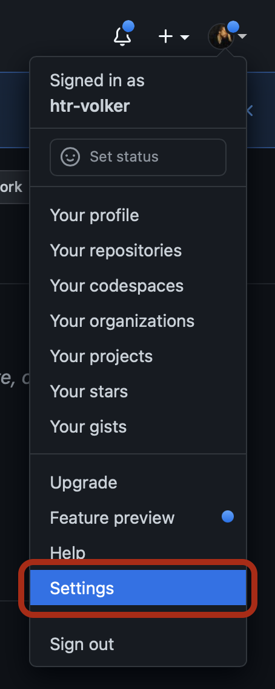

2. From the list of options on the left of the screen, find 'Developer settings' at the bottom of the list and click on it.

    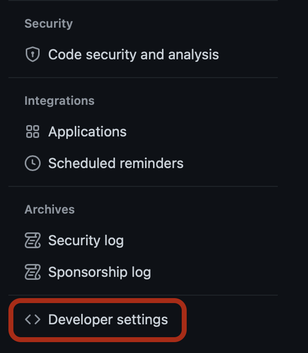

3. Click on 'Personal access tokens' on the left of the page and select 'Generate new token' on the right of the page.

    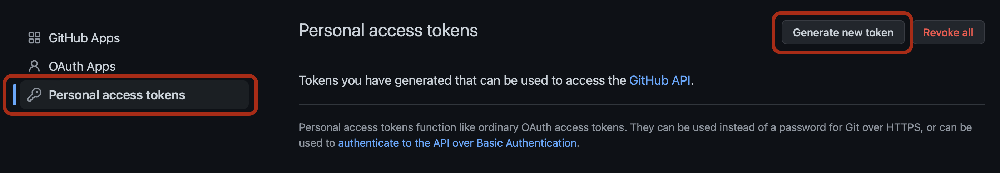

4. You will see a form to create a new token. Enter the following information:
   
   - **Note:** Give your token a name that is meaningful to you, such as 'Work laptop token'.
   - **Expiration:** Set to any timeframe you desire. Note: while you can set the token to never expire, it is bad security practice to do so.
   - **Select scopes:** select the tick box for the **repo** scope.

    Leave everything else set to its default. Then, select 'Generate token' at the bottom of the page.

    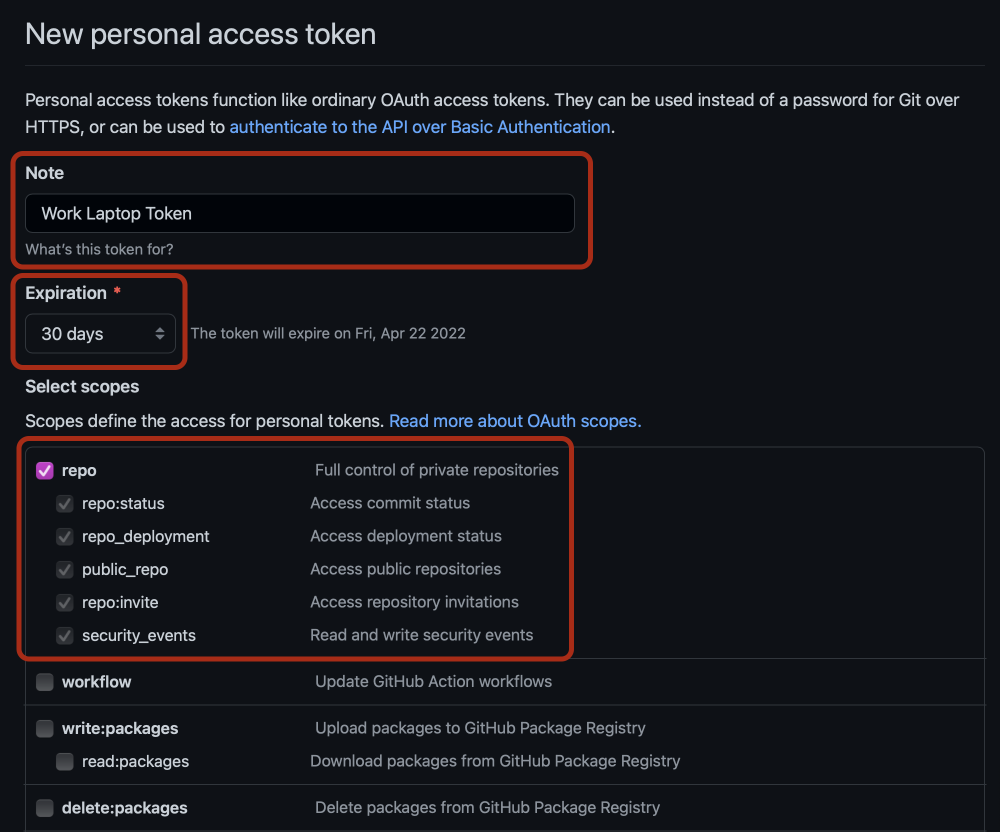

    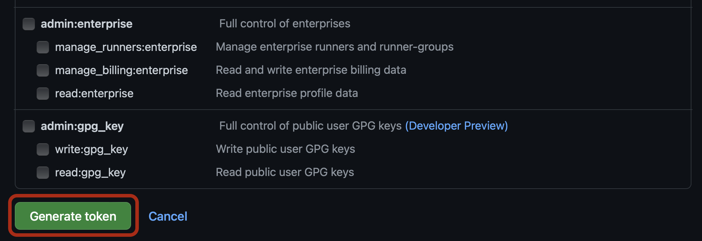


5. Copy the token that is generated and save it somewhere for later **before** you navigate aware from the page. You will need it to push to/pull from your GitHub repositories, and it will not be accessible after you close the page.
   
   If you don't copy it before navigating away from the page, delete the token and repeat the steps above to generate a new token.

    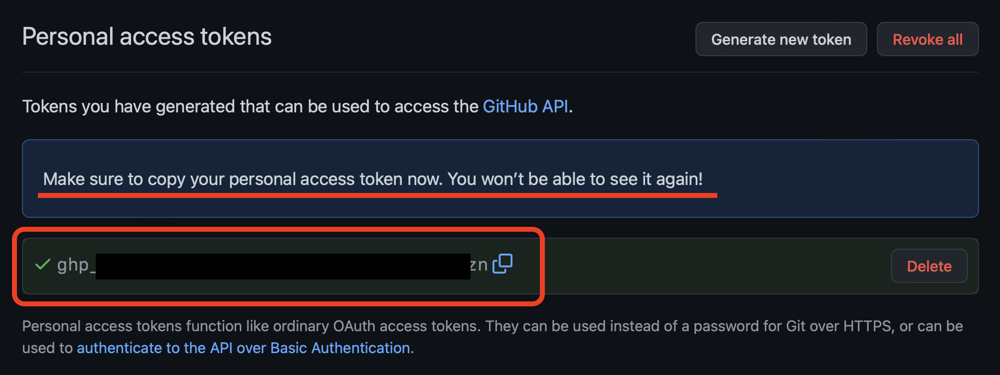

### Pushing to GitHub

Next, let's push newly committed file `my-new-file.txt` from the local repository to GitHub.

To push the file:

1. Run this command:

    ```bash
    git push origin main
    ```

2. You will be prompted to provide a username and password:
    
    ```text
    Username for 'https://github.com':
    Password for 'https://your_user@github.com':
    ```

    These are your GitHub credentials. Enter your username when prompted and hit enter.
    
    Password authentication for GitHub was removed in August 2021, so instead we will be using the PAT token generated previously. Copy the token, paste it into the password prompt and hit enter.
    
    > **Note:** The terminal will hide your input, making it look like you aren't typing anything. Don't worry, it is receiving your input! Just copy/paste the token and hit enter.

3. Navigate to your repository on GitHub to confirm that the new file `my-new-file.txt` has been pushed successfully.

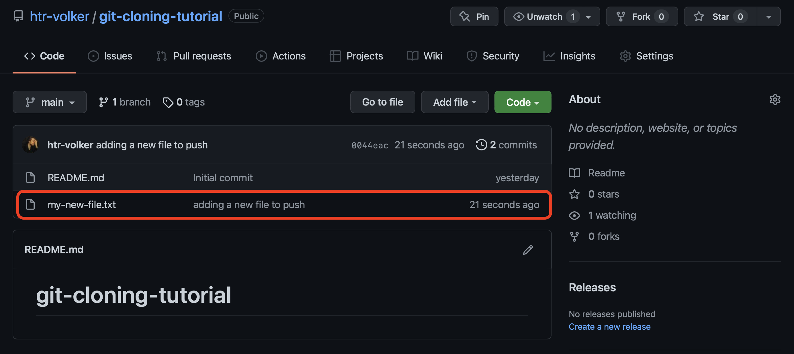

### Pulling New Changes from GitHub

Now that we have pushed our new file `my-new-file.txt` up to GitHub, let's make a change on GitHub and pull it down to your local repository.

To do this:

1. Click on the file `my-new-file.txt` in your GitHub repository to view its contents. You'll find that it is empty.

    

2. Click on the pencil icon on the right of the page. 
   
    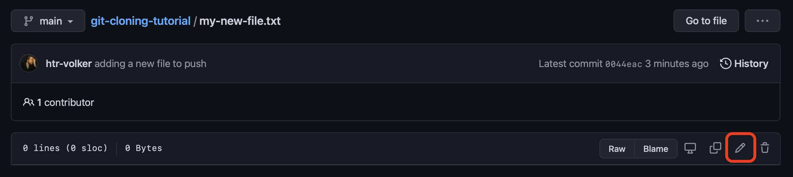
   
   This will open the file in editing mode, allowing you to make and commit changes to the file on GitHub.
   
   Type `Hello world!` into the file and commit the changes by clicking on **Commit changes** at the bottom of the page.

   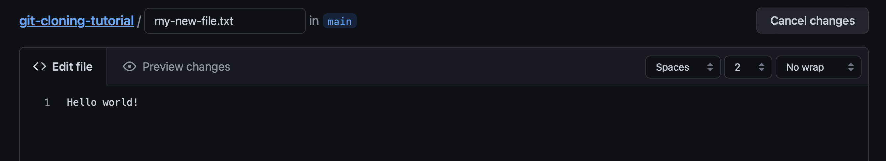

   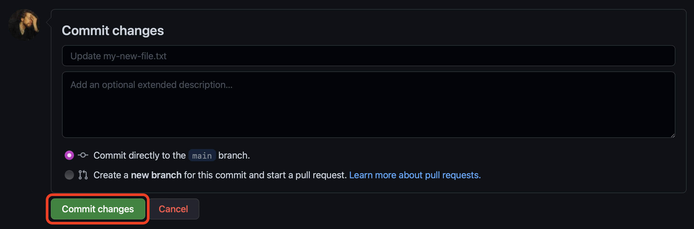


1. Open the terminal again and enter:

    ```bash
    git pull origin main
    ```

2. View the contents of `my-new-file.txt` by either opening it in a text editor (such as Notepad on Windows or TextEdit on Mac) or on the command line using the command:

    ```bash
    cat my-new-file.txt
    ```

    You should see the phrase `Hello world!`, just as it was written on GitHub.

## Exercises

- Attempt the steps in the Tutorial again, but this time try to create the repository on the command line first and set an empty GitHub repository as the *origin*.
  
  > **Hint:** After creating an empty GitHub repository (i.e. do not add a `README.md` or `.gitignore`), GitHub will provide you with the commands to run to push an existing repository.

- Clone another user's repository to your local machine. See if you can change the location of the *origin* to a GitHub repository under your username.

- Invite someone as a collaborator to one of your GitHub repositories. Get them to push a change to your repo and then pull it down to your machine, and vice versa.

    Next, get them to push a new change, then attempt to push one of your own **without** pulling theirs down. What happens? And why? Can you resolve the issue?
